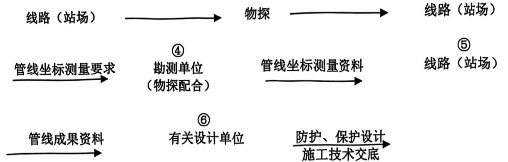
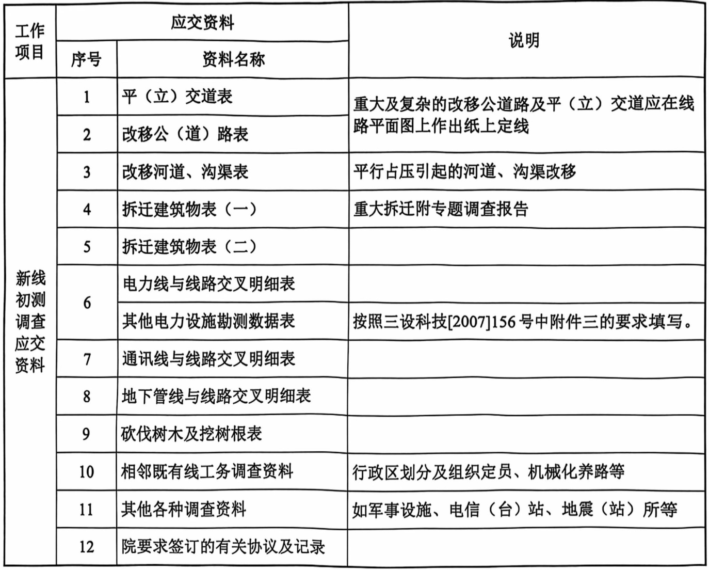

# 第二章新线初测调查工作  

## 一、调查工作基本要求  
1. 配合纸上定线，调查人员应了解定线意图及具体线位，现场调查影响线路走向的因素，特别是控制平面位置和高程的因素，并将调查情况及时反馈，以修正纸上定线线位。  
2. 通过调查及时发现地形图测绘范围内及范围以外有必要补测的重大建（构）筑物及其他控制点，并及时提出予以补测。对于地表植被或农作物覆盖茂密的地区，地下管线的标志不易发现，则需要调查人员通过沿线细致地调查、走访提供概略位置，以便采取进一步探测手段予以查明。  
3. 参与方案比选工作。对于方案比较中涉及**拆迁、道路改移、改沟改渠**等有关资料应由调查人员负责提供。  
4. 填列**平（立）交道表、改移公（道）路表，改移河道、沟渠表、拆迁建筑物表**等必要的表格。  
5. 调查者应适当扩大调查了解范围，确定是否有影响线路通过的其他重要建（构）筑物存在，尤其加强**机场、军用设施、电台、地震台等**的了解调查工作，确定军用设施拆迁数量和可能引起拆迁的电信（台）站、地震（站）所的拆迁数量。  

## 二、调查工作内容和做法  

### （一）公路、道路交叉跨越及公道路改移  
铁路与高速公路、一级公路和城市道路中的快速路交叉，必须设置立体交叉。一级铁路与其他道路相交、铁路与二级公路相交、以及铁路路段旅客列车设计行车速度大于或等于 $120\ \mathrm{km/h}$ 地段及以上线路应全封闭、全立交，调查工作应在此基础上进行。根据《铁路技术管理规程》（高速铁路部分）规定有动车组下线的既有铁路也要按**全封闭、全立交**考虑。  

#### 1. 既有公路和城市道路  

调查与铁路交叉的既有公路、城市道路资料，在图中确定铁路与公路交叉处的交叉里程、交角。调查落实既有公（道）路名称、里程、管辖单位、等级、交通量（汽车或其他机动车辆、人力车、马车、人、畜等）、最重车的载重、路基及路面宽度、路面材料及厚度、既有公（道）路改扩建规划。调查公路及城市道路两侧地形、地物，并请相关专业协助调查地质、水文、地下水及地面排水情况等。  

#### 2. 规划公路和城市道路  

应调查了解与线位相关的规划公路和城市道路，一般可在向地方政府征求意见的会议上进行，或由调查人员走访交通局、公路局、城建局和市政局等相关部门。着重调查等级公路的规划升级计划、实施年代、升级后各项技术标准及相应依据文件，收集如下资料：  

（1）规划路名称;  

（2）规划路等级及拟定标准；  

（3）规划路坐标、横断面，在图中确定相对于纸上定线的里程、交角及纵断面资料;  

（4）依据文件（应收集已批准的交通规划图）。  

#### 3. 乡村道路平（立）交道调查  

调查当地农业机械及特种车辆类型、最大尺寸，确定对立交道的特殊要求。根据以上的调查资料，通过方案比选确定重大立交工程的技术条件和立交方式。立交位置要考虑使用方便并与地方协商确定，在不过多增加立交工程投资的情况下，优先考虑在原路位置设立交。  

线路跨河时，应向沿线**河务部门**了解各条河流的**防洪通道设置要求**。  

尽量避免下挖路面设置立交。当公道路在下需下挖路面时，应根据地形和地下水条件，认真确定排水方案；山区铁路当利用排洪涵兼作立交时，应充分重视水文条件，技术上要落实，慎重研究是否有条件兼用并落实采取的措施，如无条件时应分开设置。  

乡村道路平（立）交道口的设置，在初测阶段由调查人员统筹研究区域交通规划的基础上进行确定。对涉及编制概算工程数量的立交问题，应认真研究，尽量做到接近定测阶段的实际情况。为立交而设的桥涵和利用排洪涵兼作立交较水文要求加大孔径时，调查人员应把拟定的净宽和净高要求列表提供桥涵专业。结合调查中了解到的道路具体情况及有关规定逐一确定立交道口位置，并填写平（立）交道表。  

#### 4.《关于进一步明确铁路工程设计线路交叉跨越有关规定的通知》（铁建设（2012）23号）

铁路与铁路交叉跨越应按“客运铁路上跨货运铁路（含客货共线铁路）"的原则进行或预留上跨条件。高速铁路（含客运专线铁路及城际铁路）与公路交叉跨越，应按“铁路优先上跨公路"的原则进行。如不满足上述原则，应进行经济技术比较和安全论证，报总公司审批。同时需要对上跨的公路、铁路采取可靠的安全防护措施。  

> 讨论谁上跨谁的关系

#### 5. 原铁道部、交通部联合下发《关于公铁立交和公铁并行路段护栏建设与维护管理相关问题的通知》（铁运（2012）139号）

铁路路堑上的公路路段或位于铁路线路安全保护区内，公路路肩标高高于铁路路肩或与铁路路肩等高，或低于铁路路肩1.0米以内的公路路段。对公铁并行路段，应在靠近铁路的公路路侧设置护栏。护栏应位于公路的土路肩内，并符合《公路交通安全设施设计规范》（JTGD81）等公路相关标准、规范要求，其防撞等级应根据不同的设计速度，按照《公路交通安全设施设计规范》（JTGD81）“车辆驶出路外有可能造成二次特大事故"确定护栏防撞等级。高速铁路的公铁并行路段，应按上述标准提高一个防撞等级设置护栏。  

> 讨论公铁并行路段的护栏设置

#### 6. 改移公（道）路  
由于铁路占压或设置立交需要改移的公（道）路，调查人员结合立交道的设置，提出改移初步意见，拟改移道路应填写改移公（道）路表。改移的公（道）路应作纸上定线，确定改移标准、改移长度。  

### （二）改移沟渠  
区间线路因线位平行占压沟渠引起的改移沟渠，由线路专业负责改移沟渠的调查协议及平、纵断面设计，桥梁、路基专业配合；因桥涵设置引起的改移沟渠设计，由桥梁专业负责，线路专业配合。  

需要改移的沟渠，拟定改移初步意见，做出纸上定线方案，确定主要技术标准和主要工程数量。

### （三）地下管线迁改  
为了尽量避免遗漏地下管线，现场勘测时应到地方有关部门收集沿线的各种管网资料，调查沿线给（排）水管、供热管道、油气管道、地下光缆、电缆的分布情况。对地下管线的调查不应局限于地形图上现有的。  

调查人员除进行沿线调查并随时询问当地群众外，还要走访沿线水利部门、自来水公司、电力局、长途线务站、邮电局、电信局、联通公司、煤气公司、石油或天然气公司（长途管道传输局），附近军事单位及厂矿、城建局、市政局等了解沿线管线情况，并根据调查了解到的情况对于漏测的部分，应向技术队长汇报后予以补测，调查者应将**地下管线的名称、规格及所属单位**标注在图上。  

近期可能在铁路定线位置附近实施或规划的电线路、地下电缆及光缆等，同样要调查清楚。一般可向有关电力部门、电信部门（包括铁通部门）、邮电部门、联通、长途传输局、广电部门、部队或沿线企业、乡镇了解及收集资料。  

> 调查近期规划的地下管线

与铁路交叉的地下管线，应**确定管道交叉里程、交叉角度、材料、管径、埋深**；与铁路并行因土建而引起拆迁的，应与产权或管理单位**共同确定迁改范围**。并把需设涵防护的工点按纸上定线里程列出提供桥涵专业。遇有技术复杂、问题较大时，要求有关专业参加。  

根据三设计经（2006）42号“关于明确铁路项目地下管线探测工作生产组织管理职责的通知”、三设科技（2009）79号“关于发布《地下管线探测实施细则》的通知”及三设科技（2006）47号“关于发布《铁路项目地下管线勘察设计技术质量工作的有关规定》的通知”有关规定，物探专业是实施地下管线探测工作的执行单位。  

地下管线物探委外工作由线站处组织的项目，执行《关于下发线站处地下管线调查、资料收集和物探委外工作管理规定的通知》（线站行[2016]2号）、《线站处外协人员资质及委外项目技术管理有关规定》（线站技（2014）4号）、《线站处地下管线物探委外工作交流会会议记录》及《关于物探工作质量反馈的会议纪要》有关规定。  

承担测量工作的单位是地下管线坐标测量和非金属管线挖测（由主责单位提出要求）的执行单位。  

具体工作流程如下:  

1.管线探测要求2.管线探测资料3.  

> 1. 将管线**探测**要求递送物探专业（执行探测工作），返回管线探测资料
>
> 2. 将管线坐标**测量**要求递送勘测单位，返回管线坐标测量资料
>
> 3. 线路总结管线成果资料

### （四）架空电力、通信、广播线路交叉干扰  

#### 1. 分工  

##### （1）非电气化铁路  

线路专业：负责区间与线路交叉或属于障碍性（平行占压、用地界内或高杆电力线距线路中心不满足杆高 $+3.1\mathtt{m}$ 者，下同）拆迁的路内外通信线（含信号）广播线、电力线（含电缆）等线路设备和油气管道及相关设施的调查、测绘资料的复核（测绘工作由项目队或承担勘测任务的院属单位组织测绘员完成）。  

> 对于“障碍性”的定义：
>
> 1. 平行占压
> 2. 用地界内
> 3. 高杆电力线距线路中心不满足杆高+3.1 m

通信、信号、电力专业：分别负责本专业引起的路内外的上述管线的拆改和防护调查，签订协议工作。 

> 本专业引起的，指的是因为本专业所设计工程妨碍到了已有这些管线（并非障碍性）的相关工作？

##### （2）电气化铁路  

线路专业：负责区间与线路交叉或属于障碍性拆迁的路内外通信线（含信号）广播线、电力线（含电缆）等线路设备和油气管道及相关设施的调查、测绘资料的复核（测绘工作由项目队或承担勘测任务的院属单位组织测绘员完成）。  

通信防干扰、电化防干扰专业：分别负责路外受电气化铁路电磁干扰影响的，需要采取防护措施的本专业上述管线的调查、签订迁改和防护协议（包括同时又是障碍性拆迁的工程）。  

通信、信号、电力专业：分别负责本专业引起的路内的上述管线的拆改和防护调查，签订协议工作（包括路内电磁干扰拆改与防护）。

> 区分了路内和路外

#### 2. 调查要求  
沿线路中线进行调查，凡电线路与铁路有交叉干扰的，或有可能与定线位置交叉干扰时，按电线与线路交叉明细表的要求内容作好记录。  

根据纸上定线的位置，凡影响线路的电力线、通信线、广播线路应与地方供电局、农电局、电力局、沿途单位、长途传输局、电信局、邮电局、移动、联通、铁通以及军方通信部门落实其产权单位，具体规格、线路等级、线路根数等具体资料。  

与铁路交叉的重大电力线路（超高压、高压电力线路、重要的一级通信干线以及个别拆迁工程量较大的电线路），应调查其交叉里程、交角、两侧电杆（塔）的高度及相对于铁路平面关系，测量最低电线高程。对于铁路土建工程引起平行干扰的线路，落实其电线类型及根数，并初步拟定电线类别、权属、抬高处数、改移长度和改移电缆长度，有必要时，还需要做方案比较（相关重大拆改方案如果必要，请电力、通信专业配合）。

> 重要电力线路：
>
> 1. 超高压，高压
> 2. 重要的一级通信干线
> 3. 个别拆迁量较大

根据国家电网公司文件《关于印发电网差异化和规划设计指导意见的紧急通知》（国家电网发展[2008]195号）“对于跨越主干铁路、高等级公路等重要设施的跨越应采用独立耐张段。”  

如产权单位做概算，需我院有关专业审核拆改方案及概算。  

### （五）建筑物拆迁及砍伐树木  

建筑物拆迁目的是调查了解清楚线路拆迁的基本情况，统计拆迁工程数量，勘测过程中**不**签订拆迁协议。  

#### 1. 重大工矿企业拆迁调查  

对于区间沿线较大工矿企业拆迁由线路专业牵头，相关专业配合共同到产权单位进行调查，对于每处重大拆迁，应做出专题报告。专题报告应包含以下内容：  

调查落实每个工矿企业的基本现状情况，包括整个企业的建筑面积、固定资产、可动资产、人员配备及设备情况、生产产品类型、产值、利润及企业发展前景情况；可部分拆迁时，铁路通过对企业的影响及产权单位的意见、要求；有条件时还需了解企业的资产评估资料和拆迁的大致概算，如对方提供拆迁概算时，应向其表明，概算需要由建设单位及铁三院进行审查。  

将以上调查了解情况形成调查报告，并附调查者意见，作为设计参考，不提供第二方使用。  

在设计文件中不列分企业的重大拆迁表，只列汇总表，分企业的重大拆迁表整理清楚备审查用。  

#### 2. 其它地上附着物拆迁调查  

应对沿线与铁路干扰的房屋、机井、水井、坟墓及其它建筑物等拆迁数量调查清楚。需要砍伐的树木或果树按直径及品种分类调查统计。  

为较准确计列概算拆迁改移工程数量的调查内容，要求如下：  

（1）**房屋拆迁**应落实类别、层数、权属、新旧程度、拆迁面积。  

（2）**拆迁水井**类别、管径、材料、个数、深度及对周围灌溉的影响。  

（3）果园和大片林地树种、规格及平均每亩株数，零星树木根据调查时了解的情况估列。成片果树杂树说明树种规格及每亩棵数，以便于初设确定用地界后计算砍伐棵数。果树规格分小树（6 cm以下）、中树 $6 \sim 20 \text{cm}$ 和大树（$20 \text{cm}$ 以上）三种，均以棵为单位。杂树小于6 cm的以 $m^2$ 计，大于6 cm时 $6 \sim 20 \text{cm}$ 为一级，$20 \text{cm}$ 以上每 $20 \text{cm}$ 为一级，均以10棵计列。

> 先区分果树和杂树，然后按直径分级，然后确定统计单位进行统计

（4）坟墓调查，应调查清楚墓内是棺数。应区分是否为少数民族。  

（5）小型塘坝的贮水能力及堤坝土方量。  

（6）采石场的规模：在铁路线路两侧路堤坡脚、路堑堑顶、铁路桥梁外侧**各 $1000 \text{m}$ 范围内**，及在铁路隧道上方中心线两侧**各 $1000 \text{m}$ 范围内**，禁止从事采矿、采石及爆破作业。以上内容要在外业落实纸上定线后方能列出。可采取**外业调查与地形图上统计相结合**的方法，如果园、采石场、塘坝等沿线调查时注意收集资料，再看纸上定线是否发生干扰。

> 大意是说，调查时后先不管地形图和纸上定线，回来之后再与之进行对照。  

### （六）工务  
收集相邻既有线的工务段、领工区、工区的管界、管辖长度、定员配置标准、设置位置、养路形式、机械化养路、大型机械化养路配备及使用情况。  

### （七）有防火距离要求的设施  

按照《铁路安全管理条例》、《铁路工程设计防火规范》、《油气输送管道与铁路交汇工程技术及管理规定》要求，应对沿线距离铁路较近的易燃、易爆危险品、可燃物的堆场、储罐、加油（气）站等有防火距离要求的设施进行调查和征求产权单位意见，落实其类别、储量和防火距离要求。不符合防火距离要求时，提出修改线位或计列拆迁数量。  

### （八）机场导航台、站和地震站、所  
机场导航台及通信设施、电信台、站和地震站、所等有仪表设备的单位，不仅受铁路土建工程影响考虑拆迁，还要考虑铁路行车振动和电气化铁路强电干扰的因素。调查人员必须对上述因素可能涉及的范围进行调查了解，不要局限于地形图测绘范围。调查内容为导航台、站及地震站、所的位置、名称、规模及设备仪表性质及铁路的距离要求等，并反馈相关专业。  

### （九）军用设施  
应将初步选定线路方案向当地相关军事部门进行汇报，征求军方对线路方案的意见，并对设计线影响范围内的军用设施（如营房、弹药库、靶场、雷达站、机场等）进行详细调查了解，考虑其与铁路的位置关系。在修正设计线路时充分考虑军事设施对线位的影响，考虑拆迁的，应相应调查拆迁工程量。  

## 三、调查应提交的成果资料  

### （一）下序资料  
1. 提供桥梁专业拟设道路立交的净宽、净高要求；可能需设涵防护的地下管线;  
2. 提供需要物探专业进一步探测的地下管线有关资料。  

### （二）验收资料  
勘测资料验收时应提交的资料详见下表（表 2-3-1）  

