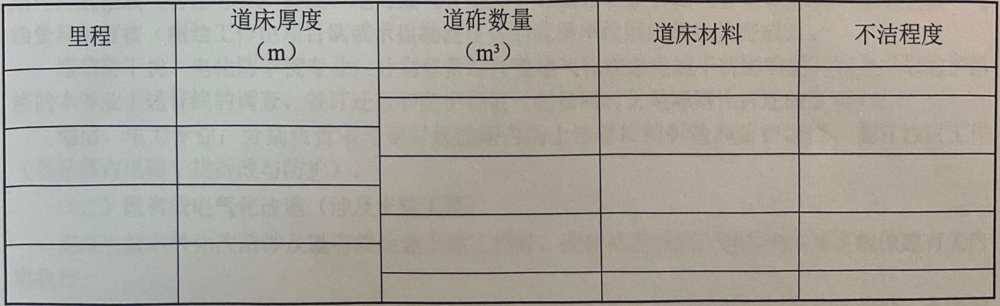
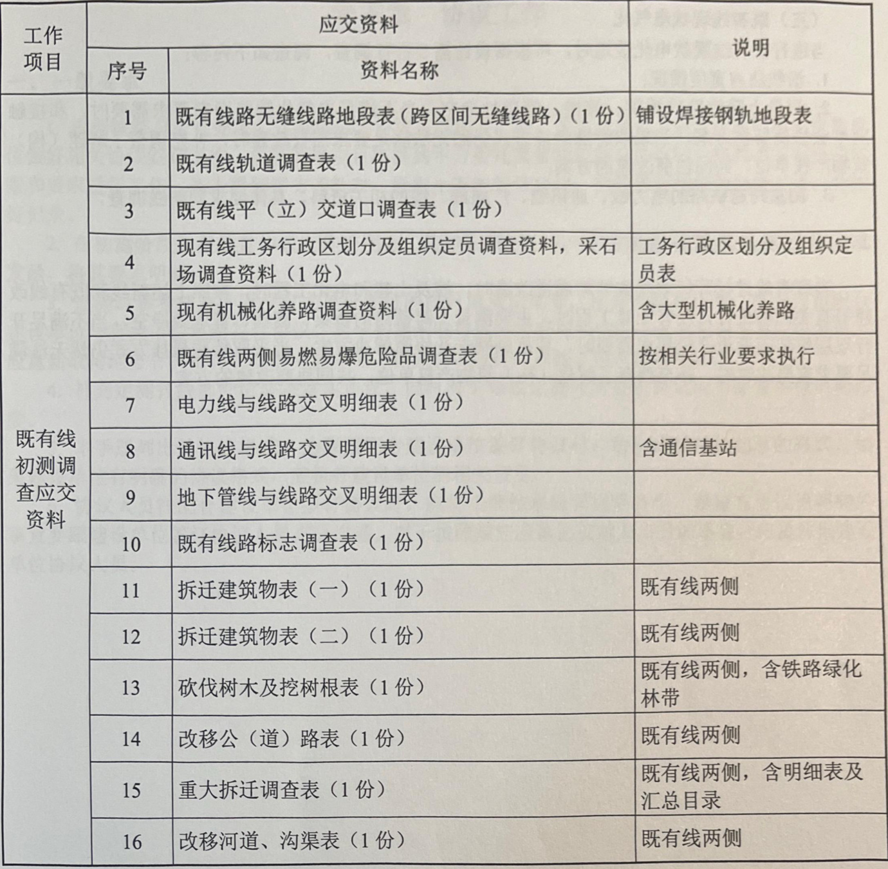

# 第四章 改建铁路调查工作  

既有线改建的调查工作，应在新线调查工作项目的基础上，结合既有线特点进行调查工作，收集最新的工务设备台帐，了解大、中修情况。  

既有线所有相关调查工作应于初测阶段完成，定测阶段只作补充和修正。  

## 一、改建铁路和增建第二线  

既有线改建、增建第二线工程一般对于既有线均有改建，需要按照既有线贯通进行调查工作，绕行线和增二线一侧根据设计需要按照新线有关规定进行，对于既有线部分着重调查内容如下。

### （一）拆迁建筑物及砍伐树木  

既有线改建、增建第二线工程应首先熟悉改建方案，根据线路改建或增建第二线方案进行调查，当线路方案较明确时，可仅调查需要加宽或增二线一侧的拆迁建筑物，当左右侧方案没有明显差别时，应对两侧的拆迁建筑物进行全面调查，详细调查的要求参照新线拆迁建筑物有关规定和要求办理。  

### （二）既有轨料  

既有轨料调查包括搜集资料和现场调查两部分工作。搜集资料是指去既有轨料管理部门收集有关轨道台账，了解与项目勘察设计有关的情况；现场调查是在搜集资料基础上，对需要进一步查明轨道及线路状况而进行沿线调查的工作。应征求路局对钢轨、轨枕利用率的意见。有关内容可利用自工务段收集的最新工务台帐填写既有线轨道调查表。  

轨料调查主要包括如下内容：  

（1）查明轨道类型、铺设标准、铺设地段；钢轨和配件磨耗、伤损情况；  

（2）轨枕的类型、数量、铺设标准及轨枕失效和伤损情况；

（3）钢轨连接接头、扣件、防爬设备类型、数量及可利用情况：  

（4）轨道加强设备类型和数量等；  

（5）尤其要加强跨区间无缝线路调查，收集完整细致的无缝线路设计资料；主要包括无缝线路结构类型、铺设地段和长度、固定区、伸缩区、缓冲区里程及锁定轨温；轨缝、位移观测桩设置位置等资料，并现场进行核对。 

> “轨料”应该是轨道设计资料的简写。涵盖了诸多关于轨道的设计信息，尤其关注无缝线路的设计资料。 

### （三）既有道床  

既有线道床调查内容主要包括既有道等级、道床厚度、道床不洁程度等。  

道床厚度应以近期工务台帐或大、中修记录资料为主，当铁路管理单位无此项资料或影响纵断面的地段应不大于 $20\mathtt{m}$ 挖探一处，测定道床厚度。隧道内及隧道外两端各 $200\mathfrak{m}$ 范围内，不远于 $100\mathtt{m}$ 挖探一处测定道床厚度。  

道床厚度调查资料由调查者归口；具体挖探工作由勘测队组织实施，按勘测细则规定办理。  

道床不洁程度较难调查，非全断面取样筛分没有代表性。调查者可按调查印象及运营、大修后的年限划分较大段落，分别订为很洁、较洁、不洁、很差四级，利用率可参照路局意见执行。  

将调查情况填入下表（表4-1-1）  

表4-1-1既有线道床调查表  

  

### （四）既有线路、信号标志

主要调查既有线线路和信号标志的设置情况，包括公里标、半公里标、坡度标、曲线标、园曲线和缓和曲线的始终点标，铁路局、工务段、线路车间、线路工区等标志设置位置、数量，按既有线路标志调查表填列。  

### （五）现有工务行政区划分、定员及设备  

应调查搜集既有工务行政区划分及组织定员、养路形式及各工务段、线路车间、线路工区的位置、管界、管辖长度、定员、养路机具配备及养路机械化作业平台、劳动组织等情况。  

根据到工务段了解的资料填列工务行政区划分及组织定员表及机工区既有养路机械设备数量表。  

### （六）既有线平（立）交道  

沿线所有的道口均应进行调查，了解车辆、行人繁忙情况和安全情况以及是否通行农业机械和特种车辆等。  

根据铁路改建后的运营变化和现有平（立）交道的实际使用情况（含排水情况），按照国家有关规定提出是否加宽、改移或封闭，是否设置看守或设立交的意见，拟定平立交道的改建初步意见，与现有平交道调查资料对照填写既有平（立）交道表（应与铁路等级相一致）。  

> 提出是否要改建的初步意见

### （七）电线与线路交叉  

与铁路交叉的里程、交角，及对铁路工程引起平行干扰的电线里程范围，电线类别、材料、根数及架空电缆的具体规格（电缆对数、光缆芯数）。  

电杆高度及电线交叉点处最低点高度（垂度），并记录实时温度（既有线改建及增建第二线应兼顾改建位置）。  

电杆距线路中心线的距离，电杆的档距及桩号（杆号及线路名称）  

路内沿线路的电力贯通线、通信及信号电缆、光缆位置，以及沿线通话柱、增音站、中继站、检查井及无线列调设备。  

填列电线与线路交叉明细表。  

非电化改造当土建工程不引起拆迁时，可不必落实所属单位。电化项目调查同新线。 

*“根据纸上定线的位置，凡影响线路的电力线、通信线、广播线路应与地方供电局、农电局、电力局、沿途单位、长途传输局、电信局、邮电局、移动、联通、铁通以及军方通信部门落实其产权单位，具体规格、线路等级、线路根数等具体资料。”* 

### （八）地下管线  

有无地下管线穿过既有铁路，可到工务段和养路工区去了解。交叉处有土建工程（帮宽路基和增建第二线）时，应测定交叉里程和交角。与铁路并行的铁路电缆，当其距铁路中心较近可能引起迁改时，要注意核对地形图上换边位置和横向距离是否准确。  

### （九）调查应提交的成果资料  

1.下序资料  

（1）提供桥梁专业拟设道路立交的净宽、净高要求；可能需设涵防护的地下管线；  

（2）提供需要物探专业进一步探测的地下管线有关资料。

2.验收资料  

验收时应提交的勘测资料详见表4-1-2和表3-3-1（新线定测）有关内容要求，一并整理完善  

  

## 二、既有线电气化改造工程  

### （一）分工  

1.非电气化铁路：（线路专业）负责区间与线路交叉或属于障碍性拆迁的路内外通信线（含信号）广播线、电力线（含电缆）等线路设备和油气管道及相关设施的调查、测绘资料的复核（测绘工作由项目队或承担勘测任务的院属单位组织测绘员完成）。  

2.电气化铁路：（线路专业）负责新建铁路、既有铁路（有土建工程）区间与线路交叉或属于障碍性拆迁的路内外通信线（含信号）广播线、电力线（含电缆）等线路设备和油气管道及相关设施的调查、测绘资料的复核（测绘工作由项目队或承担勘测任务的院属单位组织测绘员完成）。  

通信防干扰、电化防干扰专业：分别负责路外受电气化铁路电磁干扰影响的，需要采取防护措施的本专业上述管线的调查、签订迁改和防护协议（包括同时又是障碍性拆迁的工程）。  

通信、电力专业：分别负责本专业引起的路内的上述管线的拆改和防护调查，签订协议工作（包括路内电磁干扰拆改与防护）。  

### （二）既有线电气化改造（涉及土建工程）  

当既有线电气化改造涉及既有线改建土建工程时，改建地段按照上述新线和既有线改建有关内容执行。  

全线测量上跨铁路的桥梁、渡槽、管道处净空，当不满足电气化铁路净空要求需要时，和接触网专业协商解决方案，当采取特殊悬挂方式仍然无法满足要求需要改建时，补充调查了解建（构）  筑物产权单位，共同协商改建万案。  

> 进一步学习：什么是电气化铁路的净空要求？什么是接触网专业？什么是特殊悬挂方式（对应于一般悬挂方式）？

### （三）既有线现状电气化  

当进行既有线现状电化改造时，可根据设计需要进行调查，调查如下内容：  

1. 沿线路肩宽度情况；  

2. 测量上跨铁路的桥梁、渡槽、管道处净空，当不满足电气化铁路净空要求需要时，和接触网专业协商解决方案，当采取特殊悬挂方式仍然无法满足要求需要改建时，补充调查了解建（构）筑物产权单位，共同协商改建的方案；  

3. 测量跨越铁路的电力线、通讯线、广播线、缆的相关资料，具体要求同新线调查。  

## 三、开行双层集装箱通道  

当既有线进行开行双层集装箱通道改造时，涉及土建和电化工程时，按照上述新线和既有线改建等有关内容进行，没有土建工程时，主要测量上跨铁路的桥梁、渡槽、管道处净空，当不满足开行双层集装箱通道净空要求需要时，和接触网专业协商解决方案，当采取特殊悬挂方式仍然无法满足要求需要改建时，补充调查了解建（构）筑物产权单位，共同协商改建的方案。  