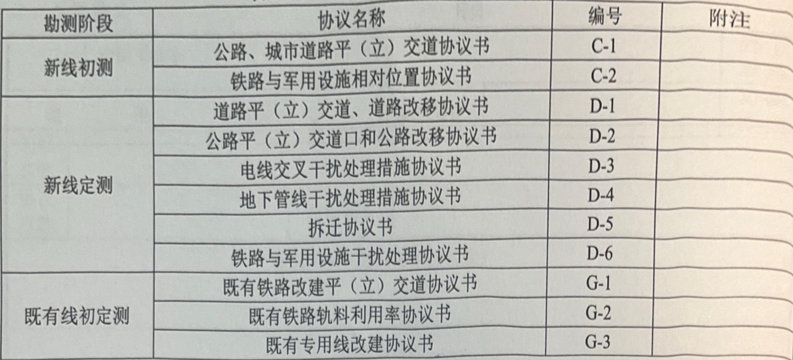

# 第五章 协议工作  

## 一、一般要求  

1.根据铁路总公司要求，建设单位为协议（或纪要）签订的主责单位，设计院应积极配合建设单位做好相关协议签订工作。如新开展项目在得到甲方委托需要我院签订协议时，按照甲方委托的权限和要求进行工作；若未得到甲方委托时，原则上不能签订协议，但应作好相应的调查工作，并作好记录。

2.在初测阶段如果签订协议工作有困难，可以在征求意见时提请地方政府给建设单位或我院发函，将其要求明确。  

3.定测时参考初测阶段与有关单位签订的协议或谈话纪要，根据定测线位置，调查人员配合建设单位与有关单位重新签订协议。对于初测未取得地方政府对线位的书面意见或方案发生变化，应重新取得地方有关部门明确的书面意见。重大协议应提前报处、院审查后签订。  

4.补充定测打线部分应逐项落实协议，同时对于该段定测时所签的协议应与原签单位声明作废。  

5.本手册列出的协议格式，为我院配合建设单位签订协议时，协助建设单位起草的格式，如果建设单位有明确的协议格式，应执行建设单位的相关规定。  

6.协议人员在配合建设单位签订协议时，应将主要技术资料提供齐全，希望在协议里明确的事宜要跟建设单位签订协议人员充分沟通。对于按照规定应该协议对方出资的事宜，应提前报建设单位协议人员。

> 提供技术资料，沟通明确的事宜，出资问题。  

## 二、协议格式

### （一）协议书样本

  

  

### （二）综合说明  

#### 1.常用协议目录

铁路勘察设计一般需要落实的常用协议共计11种，见表5-1-1：  

  

#### 2.常用协议标准格式  

##### （1）公路、城市道路平（立）交道协议书（C—1）  

铁路进行初测，为确定线路方案和工程投资，需要对设置公路、城市道路平（立）交道问题进行原则性落实。为此，____公司（筹备组）与____地区（市）____县（区）交通局、城建局，按照国家有关规定和现场实际情况进行了协商，取得了一致意见。如批准铁路按本初测方案修建，则在____处设平交。在____处设立交，详见所附平（立）交道表。  

立交工程投资划分、产权归属及养护维修分工按照《铁路安全管理条例》（国务院令第639号）办理。  

铁路定测时，铁路方面将再次派员与对方签订具体协议。届时，双方应承认本次协议确定的主要原则。  

本协议一式____份，____（单位）____份，____公司（筹备组）____份，同等有效。  

> 筹备组的概念是什么？

##### （2）铁路与军用设施相对位置协议书（C-2）

修建铁路需要从所辖附近通过。为此公司____（筹备组）与____进行了协商。军方根据有关规定，提出铁路距____应不小于____m。铁路方面表示同意按照军方要求选定铁路位置。  

本协议一式____份，____（单位）____份，____公司（筹备组）____份，同等有效。  

##### （3）既有铁路改建平（立）交道协议书（G-1）  

既有铁路改建平（立）交道协议书（G-1）  

铁路____段既有线需要改建，____公司（筹备组）与____地区（市）____县（区）人民政府对既有平（立）交道进行了认真调查研究。按照国家现行有关规定，结合铁路改建后新的运行情况，并考虑到过去地方对现有平（立）交道使用所发生的实际情况，双方对改建铁路平（立）交道的设置进行协商，取得一致意见。详见附表____张。  

本协议为铁路改建而定，国家批准设计文件并投资改建铁路时生效。铁路改建**停建缓建**时，仍维持既有现状。 

> 意味着如果不改了，维持既有现状即可。

本协议一式____份，____（单位）____份，____公司（筹备组）____份，同等有效。  

##### （4）既有铁路轨料利用率协议书（G-2）  

铁路____段既有线改建，____公司（筹备组）与____铁路局工务段就既有轨料利用率问题，进行了调查研究和协商，就本线站至站间的轨料利用率达成如下一致意见：  

钢轨： $60\mathrm{kg/m}$ 为____$\%$ ，$50\mathrm{kg/m}$ 为____%;  

轨枕：木枕为____ $\%$ ，钢筋混凝土枕为____%；  

道作：碎石道（面作）为____ $\%$  

本协议一式份，____（单位）____份，____公司（筹备组）份，同等有效。  

若鉴定审查意见与本协议不一致，则利用率**以鉴定审查意见为准**。  

##### （5）既有专用线改建协议书（G-3）  

铁路____段既有线改建，引起车站____专用线改建，经____公司（筹备组）与____（专用线产权单位）协商，达成如下一致意见：  

1.同意对____专用线 $\mathbf{KX+XXX\sim KX+XXX}$ 段共$XXkm$进行改建。  

2.改建工程维持原工业企业线标准（既有标准）。  

3.改建工程由铁路部门投资并施工。

> 明确投资和施工都由铁路部门，新线应该也是同样的，但不需要具体说明。  

本协议一式____份，____（单位）____份，____公司（筹备组）____份，同等有效。  

##### （6）道路平（立）交道口和改移道路协议书（D-1）道路平（立）交道口和改移道路协议书（D-1）  

新（改）建____铁路DK____+____至DK____+____段在____县（区）____镇（乡)境内通过。____公司（筹备组）与____县（区）（市）____乡人民政府按照国家有关规定和现场实际情况，对该段铁路 与乡村道路的交叉干扰问题进行了协商，达成一致意见如下：确定设置平交道口____处，立交道口____处，改移道路____处，其余道路____县（区）（市）____乡人民政府同意封闭。详见附表____张。  

> 这意味着新建或者改建都要遵循这一模板签订协议。

工程投资划分按国家有关规定办理。

> 这意味着工程投资并非完全由铁路部门承担。  

平交道口和铁路立交桥涵，为铁路固定资产，由铁路部门负责养护维修。改移道路、道路桥涵、立交道路桥、立交引道及附属工程设施（含立交机械排水、泵房和电线等）均为地方固定资产，由地方负责养护维修。

> 对于铁路固定资产和地方固定资产的划分，意味着养护维修的责任。  

本协议一式____份，____（单位）____份，____公司（筹备组）____份，同等有效。  

##### （7）公路平（立）交道口和公路改移协议书（D-2）  

新（改）建____铁路DK____+____至DK____+____段在____地区（市）____县（区）境内通过。与____市（县）交通局（公路局或其他单位）所辖公路交叉干扰____处。____公司（筹备组）与____地区____区（市）____县（区）交通局（公路局）按照国家有关规定和现场实际情况，就处理铁路与道路交叉干扰问题进行了协商，达成一致意见如下：  

1. 设置立体交叉____处，改移公路____处。设置立交道位置、立交形式、改移道路范围、有关技术标准详见《公路、城市道路立交表》____张及《改移道路表》____张。限界标准见附图。  

2. 道路立交净高起算高程在立交表中明确，并说明高程系统。  

3. 改移道路及立交工程投资划分执行《铁路安全管理条例》（国务院令第639号）规定。工程建成后，铁路桥及附属工程设施为铁路固定资产，由铁路方面负责养护维修；公路桥、公路引道以及为保证公路正常运营的附属工程和设施为公路产权单位的固定资产，由交通局（或公路局或其他单位）负责维修管理和承担相应的费用。 

> 资产的划分与D-1类似。 

本协议正文及附表一式份，____（单位）____份，____公司（筹备组）____份，同等有效。  

本协议需经铁路建设主管部门审核批准后生效。  

注：

1. 每处公路的主要技术标准，如：等级、行车速度、行车道宽、中间带宽、最大坡度、汽车荷载、路面结构、排水设施等，必须在协议中明确；对行车道是否分幅、是否设置中间带以及中间带是否设墩等要求必须在**协议中叙述清楚**；铁路在下时应明确铁路净高及净宽标准和要求。对施工期间过渡措施及要求、配合要求等应取得意向性意见。对改移公路原交叉位置的处理应在协议中明确，封闭或保留平（立）交。  

2. 将达成协议的公路平（立）交道口和公路改移的技术资料填写《公路、城市道路立交表》并加盖甲乙双方公章，作为协议附表。  

3. 当就某处交叉签订协议时，应将各项技术标准以条款形式**在协议中叙述清楚，不需附表**。  

4. 铁路立交桥涵跨度及净高、平交道口宽度、改移公路标准等，原则上按现状标准签订协议，若地方要求提高设计标准及有投资划分时，则在协议中应说明： $\times\times$ 公路由于甲方规划加宽（高）而增加的工程投资按《铁路安全管理条例》（国务院令第639号）办理。（根据工程具体情况将639号文的相应条款内容在协议中明确）。

> 4的意思是，因为在未来有加宽的计划，其上跨的幅度要增加，工程投资势必因而增加……  

##### （8）电线交叉干扰处理措施协议书（D-3）    

修建____铁路，在____所辖（产权单位？）电线发生交叉干扰干扰，____处，为此，____公司（筹备组）与____进行了协商。取得一致意见。确定抬高电线____处，改电缆通过____处，改移____处。详见附表____张。  

具体拆迁及赔偿事宜由铁路建设单位或施工单位与产权单位进一步协商确定，由建设或施工单位支付赔偿款。  

本协议一式____份，____（单位）____份，____公司（筹备组）____份，同等有效。  

##### （9）地下管线干扰处理措施协议书（D-4）    

修建____铁路，在____附近与____所辖发生干扰，交角____，高程____。为此，____公司（筹备组）与____进行了协商。根据____规定，取得一致意见如下：

（具体内容）。  

说明：在一致意见中应包括以下内容

1. 同意 $x x$ 铁路通过。  

2. 明确迁改原则、方案。  

3. 明确交叉通过时的技术要求，如通过形式（桥梁、涵洞、路基）、防护形式（圆管、板涵、直埋或设井）。  

4. 明确赔偿原则及形式：由产权单位提出预算书，经设计单位审核，作为编制铁路工程概算的依据，并报铁路建设单位审批。具体拆迁及赔偿事宜由铁路建设单位或施工单位与产权单位进步协商确定，由建设或施工单位支付赔偿款。  

> 提出预算，审核，编制概算，审批，协商确定，支付赔偿款。

1. 明确铁路施工中对拆改的有关要求（时间、相互影响、配合等）。  

本协议一式____份，____（单位）____份，____公司（筹备组）____份，同等有效。  

##### （10）拆迁协议书（D-5）  

在勘测期间如何落实拆迁工程量要视具体情况而定。首先要积极主动地与地方接触，争取更多的达成一致意见，确定拆迁工程，为工程投资提供可靠准确的基础资料。提高投资估（概）算准确性。当对某一问题双方不能达成共识的情况下，当乙方对甲方的要求或条件有不同意见或不能完全认同时，应以谈话纪要将甲、乙双方对有关问题的各自看法如实写入纪要，并需经甲、乙双方签认。对某一问题当甲方不能接受乙方的意见，且持不配合态度时，由乙方写成谈话记录收入调查资料，作为设计参考。对于拆迁一般建筑物、砍伐树木及迁移坟墓等协议，由建设单位根据实际确定格式，我院配合。对重大厂矿企业一般应签订原则性协议。

> 有分歧的时候写纪要（签字）或者谈话记录；不同类型的拆迁建筑物不同处理方式；什么是原则性协议？  

###### 厂矿、企业拆迁协议书D—5  

新建____铁路DK____+____处与属____所属的____厂矿干扰，需要拆迁。为此，____公司（筹备组）与____厂矿产权单位、地方支铁办进行了协商，就拆迁事宜达成如下一致意见。  

​	一、为保证铁路修建，产权单位同意拆迁矿。  

​	二、有关具体拆迁赔偿事宜，由铁路部门在铁路建设工程实施时再与产权单位进一步商定。  

​	三、对所拆迁建筑物进行了清点、数量丈量，意见一致。（初测时取消此条）  

​	四、具体拆迁位置（对应本次铁路勘测）里程详见附表张。（初测时取消此条）

本协议一式份，____（单位）____份，____公司（筹备组）____份，同等有效。

本协议需经铁路建设主管部门审核批准后方可执行。  

（11）铁路与军用设施干扰处理协议书（D-6）

修建____铁路，在____附近与____所辖____发生干扰。为此，____公司（筹备组）与____进行了协商。根据____规定， ____距电化（非电化）铁路不小于____m。全面考虑铁路绕避或迁改军方设施的技术经济合理性，双方一致同意迁改军方设施，并均已报请各自上级机关核准。  

迁改费用补偿标准按国家有关规定办理，军方将迁改工程预算书报铁路部门，经审查核准后列入铁路工程总投资并报请铁路建设单位批准。迁改费用由铁路建设单位支付，包干使用，军方自行迁改。迁改及付款时间由铁路建设或施工单位具体负责与军方进一步联系确定。  

本协议一式____份，____（单位）____份，____公司（筹备组）____份，同等有效。  

### （三）分项说明  

#### 1.公路、城市道路平（立）交道协议书（C-1）  

（1）初测推荐方案的公路、城市道路交叉，都应签订平立交原则性协议，比较方案与推荐方案分开签订；  

（2）协商好的几处平交、立交，均应在协议种注明纸上定线里程和相应的公路里程；  

（3）对于规划和提级道路，对方能出具文字依据的，应按里程顺序列入协议，并注明规划情况和提级道路的原路等级；

> 铁路设计要考虑到远期这些公路的规划和提级，因此这部分的文字依据有必要列入协议。

（4）初测推荐方案上的公路、城市道路改移，也要签订原则性协议，配合使用“改移公道路表”。  

#### 2.铁路与军用设施相对位置协议书（C-2）  

（1）考虑到军用设施的特殊性，凡铁路从军事设施附近通过，都要与军方签订原则性协议；  

（2）军用设施指**靶场、弹药库、营房、有电气设施的台站**等，军用道路、电线、管道等按照其他格式签订；  

（3）国家和军方有文件规定的，均按照规定执行，无明文规定的，当军方要求加大铁路投资和恶化技术条件时，可仅做谈话纪要。 

> 仅做谈话纪要，意味着可不签协议 

#### 3. 既有铁路改建平（立）交道协议书（G-1）  

（1）既有铁路改建，当原线提高能力，电气化改造或增建第二线等主要原则确定的情况下于初测阶段一次性签订平立交道协议。如果改建主要原则需经可研文件鉴定后方能确定，此项协议应于定测阶段签订。 

>  这意味着只有当主要原则确定以后方可签订该协议，初测定测阶段签都可以。

（2）既有线平（立）问题较复杂，应与地区、市和县、区级人民政府签订，并充分了解使用单位的意见。  

（3）本协议内容范围包括地区和市级交通局、城建局所辖公路、城市道路以及所有乡村道路。  

（4）所有既有平立交道及拟增加或移位的均按统一里程顺序填列一览表。注明改建情况，如拆除、原位保留加宽、增设或平交改立交等。  

> 这里体现了四种关于平（立）交道的改建情况。

（5）平交改立交、公路提级立交改建和规划路设立交等内容较复杂时，改建栏内可简略说明或注上“具体内容见附页”，而后在空白页上详细写明。对于个别工点一时很难协商一致时可作出谈话纪要。  

#### 4. 既有铁路轨料利用率协议书（G-2）  

（1）既有线改建其轨料利用率主要涉及可研设计概算，所以无论改建轨道类型能否最后确定，初测时均要落实轨料利用率情况，如果初测时对改建的轨道类型已有初步意见，即按初步意见考虑。如果尚无初步意见，即按既有类型签订协议。 

> 利用既有轨料逻辑上可以减少工程投资。 

（2）既有轨道情况较一致的，订一份协议，既有轨道情况出入较大的，可分段签订。  

#### 5.既有专用线改建协议书（G-3）  

在调查既有专用线产权单位，落实其等级、技术标准后，与专用线产权单位签订；在“（既有标准）”处应注明线路等级、最小曲线半径、限制坡度、最小坡段长度；在施工过渡期间，若有赔偿要求，应在协议中注明。  

> 概念“施工过渡期”

#### 6.道路平（立）交道和改移道路协议书（D-1）  

本协议应与乡镇及以上人民政府对口签订，请县区人民政府派员参加。如县区不能参加，协议应送其盖章并分送一份。本格式适用于新线定测农村道路协议。对于县区交通局不管的乡间道路也应一并签订；  

立交工程协议的配合工作，由线路专业牵头，桥涵专业配合。应对沿线的所有道路进行细致的研究，结合实际情况应对每条道路有明确的处理意见（封闭、改移或立交），凡原有各种道路与线路交叉需设立交道时，均应与有关单位签订协议。需要在协议中明确以下内容：  

（1）工点里程（应包括铁路与公路或道路交叉点的里程，并注明与原路中心的关系，向那一方移动多少距离）；既有公（道）路等级及路基宽度，路面材料等标准；既有交叉情况及设计立交交叉方式（公路在上或在下）。  

（2）公（道）路设计技术条件：采用公路设计规范、公路等级、交叉角度、立交道净宽（等级公路净宽应尽量考虑公路两侧排水沟的处理问题）、净高等基础资料（对于有等级的公路应以公路规范中规定的建筑限界图表示，对于无等级道路可用净宽、净高表示），并应明确道路立交净高起算高程，并说明高程系统。还应明确荷载标准、引道最小曲线半径、最大坡度、路面标高（公路在下时要考虑是否要分慢车道及快车道及其标准）等。  

由于平原地区立交净高对线路纵断面影响较大，签订协议时应进行整体规划，大段落综合考虑立交设置位置、立交净高分布，与改移道路共同考虑，做到立交设置密度合理。  

> 整体规划，综合（结合改移道路）考虑立交设置位置和净高分布。

立交道路净宽设置应留有余地，考虑一定的发展。协议中应明确具体孔径，尽量避免设置两孔涵洞，特殊情况下不得不设时，应在协议中明确。  

> 概念“两孔涵洞”（应该尽量避免）。

（3）道路立交协议附表中应在说明栏中尽量将有关问题说清。比如：立交兼排洪，道路从××桥下通过，需要拾道或落坡时应将改动后引道坡度（平原地区道路下挖应有充分理由）、排水方式、排水去向及出口位置、公路侧沟的设置方式及道路立交交叉角度优化后道路顺接情况详细交代。

> 概念：拾道、落坡  

（4）改移道路时，若需要修建过水建筑物，应在协议中明确过水建筑物的具体标准，以免在施工时在设计标准上发生不必要的纠纷。在立交引道或改移道路上有桥涵的协议，均应有桥梁专业人员参加签订。

> 过水建筑物明确标准，避免不必要的纠纷。  

（5）在线路跨越大河时，应与沿线河务部门签订防洪通道立交设置协议，明确采用的立交方式（堤上立交或堤下立交），若为堤下立交，顺接道路应考虑硬化处理措施。

> 跨大河的时候考虑防洪的需求。  

（6）改移所有乡村道路，必须取得使用单位的同意，并应方便农村人、畜、车辆的通行。在协议中明确改移公路起讫里程、道路等级、路面宽度、路面标准、排水情况。  

> 取得同意、方便通行。
>

（7）乡村道路的改移，原则上按照原有道路标准，但原来为自然型的道路在改移时可针对具体情况酌情改善原有条件。  

> 乡村道路改移所遵循的标准。

（8）按照《铁路安全管理条例》规定，明确投资划分情况及产权单位。 

> 《铁路安全管理条例》是需要参照的重要文件，本手册已经多次提及，设计投资、产权划分以及分工等。 

（9）平交道口应按里程顺序填入表内，以铺砌宽度区别，不另加注明。  

（10）平交道口表中备注栏内应写交叉点移位设道口、跨多线铁路等事项。  

（11）有立交或改移道路上有桥涵的协议，均应有桥涵专业人员参加签订，两专业均留存底。

> 要求桥梁专业参与。  

#### 7.公路平（立）交道口和公路改移协议书（D-2）  

部分省份省交通厅直控的公路，要求建设单位发函上报，交通厅对于上报方案进行批复。我院应配合建设单位完成立交材料的附件，具体内容、格式可按照建设单位与省交通厅协商的结果办理。  

（1）本协议格式平交道口和改移公路附表与定测道路协议通用。立交附表与初测协议通用。  

（2）公路一般归县区级和地市级交通局或城建局管辖，个别的由省厅直控。应根据管辖权限确定同哪一级签订协议。  

（3）本协议格式现有文字适用于按既有公路原标准情况。如对方提出公路升级或要求考虑能出具批文的规划公路，也可一并订入本协议，但要另加说明。在后面未尽事宜线格上写“xx”为提级，XX 为规划路，其有关协议事项见“附页”，而后加附页续写，数据仍填入表内。如只有提级规划路，不必使用本格式。

> 除了按原标准的既有公路，有一部分路可能会提级，也有一部分路是新规划的。  

（4）涉及立交工程较简易的城市街道也可写入本协议格式。  

（5）立交表下的附注，可写协商一致的立交照明等细节事项。  

（6）应确定每处改移公路的主要技术标准，如：交叉里程、交叉角度、交叉方式、改移起讫里程、改移公路等级、行车速度、行车道宽、中间带宽、最大坡度、汽车荷载、路面结构、排水设施等，必须在协议中明确；对行车道是否分幅、是否设置中间带以及中间带是否设墩等要求必须在协议中叙述清楚。铁路在下时应明确铁路净高及净宽标准和防护要求。  

（7）应与产权单位签订协议，和桥梁专业共同协商，落实投资划分情况（投资划分按《铁路安全管理条例》（国务院令第639号）办理），对施工期间过渡措施及要求、配合要求等应取得意向性意见。并应明确施工过渡期间临时便道的等级和技术标准。  

> 对于施工期间过渡的要求。

（8）对改移公路原交叉位置的处理应在协议中明确，如封闭、改移或保留立交。经过双方协商好的公路改移及立交情况，均应以相应的表格填写清楚后附入协议。对于规划及提级公道路，对方能出具文字依据的，也应按照里程顺序列入协议表格中。在表中附注里注明哪条为规划路，哪条为提级路及原路标准。  

#### 8.电线交叉干扰处理措施协议书（D-3）  

签订协议前需调查清楚通信线的架设方式（架空、地下直埋）、规格（电缆为 $x x$ 对，光缆为 $x x$ 芯）、根数（地下线路是否同沟埋设）、线路等级等情况，电力线路应调查清楚电线类型、根数（应注意区分双导线和双回路的不同架设方式）及两侧电杆（塔）的高度及与线路的相对关系、电线垂度。  

三电拆迁协议应与产权单位签定，并征求产权单位改移拆迁技术要求，并与产权单位落实保护措施，由牵头专业和相关专业共同签定（技术复杂的会同有关专业共同签订协议）。高压电线走廊应由产权单位报改建投资概算。  

有些重要输电线路签订拆迁协议时，应提供对方(大概是提供给对方的意思）局部图纸及相应轨顶设计高程，当签订协议时尚不能最后落实者，先行提供初步确定的数值，并说明该轨顶设计高程为概略值，以便最终调整概算。 

> 输电线路拆迁的时候，轨顶设计高程是决定概算的重要因素。 

协议中应明确需要拆迁通信线、电力线、广播线的线路位置、迁改长度、根数、类别、用途、所属单位。  

（1）对于技术复杂，迁改困难，工程费用较高的高压电力线（一般指100KV以上）拆迁。对方提出迁改工程概（预）算后，经审核后确定款项写入协议，迁改工程概（预）算不作协议附件，但我方应存留备查。  

（2）100KV以下高压电力线、一般电力线及通迅线的迁改，不需由产权单位提出概算。但要将双方商定的“迁改处数及其处理方式、引起的费用由铁路部门支付、具体迁改事宜待铁路施工时由施工单位与产权单位商议”等项内容在协议中写明。  

> 在处理电力线时候，是否由产权单位提供概算视电压值情况而定。

（3）附表中交角可仅填通讯线的。  

（4）附表中电线类别如为电力线，应写明电压值。  

（5）轨顶设计高程在订协议时尚不能最后落实者，先在表中填列初步确定的数值，并在表下附注中说明轨顶设计高程为概略值，及准确值以后如何提供。  

（6）有些较重要的输电线路，对方需要我方提供局部图纸以便其作设计：该类事项也可写在附表下面附注内。

（7）对方需要作迁改设计的重要电线路，当订**许可性协议**时，尚不可能提出准确处理措施数量，可写约数，但必须填写，以便修改概算有所依据。  

（8）既有电缆不订入本协议。  

#### 9.地下管线干扰处理措施协议书（D-4）  

（1）原油、天然气长输管道  

原油、天然气长输管道协议可参照国家能源局、国家铁路局联合下发《油气输送管道与铁路交汇工程技术及管理规定》（国能油气[2015]392号）与产权单位或委托管理单位协商确定交叉干扰处理措施。  

交叉角度宜为正交，特殊情况下需要斜交时，夹角不宜小于45度；交叉处宜修建专用保护桥涵从地面下通过。  

防护涵洞宽度一般按管道包括防护层的外径加 $2.5\mathfrak{m}$ ，洞顶至自然地面高度为 $1.8\mathfrak{m}$ 。如达不到上述尺寸要求时，双方应通过协商解决。铁路桥梁跨越油气管道交叉位置处，梁底至自然地面高度不得小于 $2.0\mathtt{m}$。

> 有规定，达不到规定需要协商解决。

对于地下管线的迁改协议应明确处理措施、管道交叉里程、交叉角度、材料、管径、埋深、管顶高程、管底高程；对于改移的地下管道，应明确改移方案、改移长度及施工过渡情况；对于设涵保护的地下管线，应根据石油、天然气管道防护规定确定合理的保护措施。  

（2）上、下水管道协议  

水管与铁路交叉应有防护措施。防护设施的作用一般是为了避免水管受铁路荷载的有害作用和保证铁路下压的水管能够检查维修。防护办法一般为设置涵洞。防护涵的孔径与高度根据水管外径和产权单位对检查维修的作业条件要求通过协商确定，一般尚应考虑在侧沟外防护涵出入口作阀门井型式。协议应明确处理措施、管道交叉里程、交叉角度、材料、管径、理深、管顶高程、管底高程；明确涵洞的净高、净宽及起算标准，并应留有一定的施工防护间距，如果是谈话记录，还应明确产权或管理单位的要求及铁路方面采取的相应措施。  

（3）地下管线一定在挖测出有关数据后再订协议。因为位置、交角、高程及该处铁路填挖高等影响协议内容。  

（4）供填写位置的线格较长，是考虑非一次交叉或平行干扰拟改移时写范围的。如为平行干扰，将“交叉”两字圈去。  

#### 10.拆迁协议书（D-5）  

厂矿、企业等重大拆迁一般情况下，仅签订原则性拆迁协议，不签订具体拆迁协议或纪要，并按照调查要求编制详细的拆迁调查报告。  

> 原则性协议、具体协议、许可性协议

#### 11.处理铁路与军用设施干扰协议书（D-6）  

（1）本格式在初测阶段可用于订原则性协议。考虑到军用设施拆迁费用可能较大，影响方案比选和概算准确性，也可在初测阶段即按具体协议深度订。如初测按原则性协议深度订，则在未尽事宜线格上加写“铁路现为初测阶段，铁路定测时，将再签订具体协议”。如初测按具体协议订，则在未尽事宜线格上除写明拆迁费用及有关条件外，尚应写“本协议当铁路方案审查批准，投资落实修建时有效”。  

（2）本协议在定测阶段不宜订许可性协议。  

（3）有关规定：当有明文规定时，写文件名号；当无明文规定时，可写“根据协商意见”而圈去“规定”两字。  